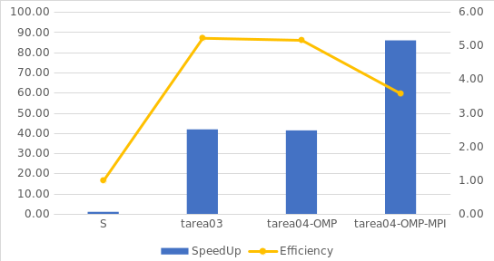

# Analisis de Resultados Tarea-04

## Para realizar el analisis de resultados se utilizara el siguiente grafico

### Comparacion Pthreads con OpenMp

En el grafico no se incluyen los tiempos de ejecucion, sin embargo, con solo ver el SpeedUp y la eficiencia podemos concluir que los resultados son los mismos, de hecho, se me encontro mas facil implementar la tarea con OMP, debido a su facilidad para crear y distrubuir trabajo entre los hilos.

### Comparacion Pthreads con OpenMp/MPI

AL implementar MPI, se debia de tener cuidado con el manejo de la entrada y salida de datos, sin emnargo, no fue complicado de realizar, cabe recalcar que los resultados indican que en cuanto a velocidad dividir el trabajo entre procesos mejora mucho el tiempo de ejecucion, sin embargo, la eficiencia sufre una decaida debido a lo exigente que resulta ser usar 3 preocesos con 8 hilos cada uno.