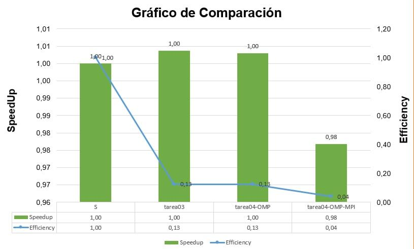

# Grafico de comparacion de la Tarea 04



### **Introducción del caso**

Para estas implementaciones se programó un vector de primos que funciona con una relacion de 1:1 (es creado por un solo proceso). Este vector es del tamaño del número más grande ingresado por el usuario y por cada posición asigna un 1 si es primo y un 0 si no es primo.

En el siguiente segmento se explica como se crea esta vector:

```
create_prime_vector(std::vector<int64_t>& prime_vector, int64_t size) { 

  prime_vector.resize(size);
  // Se crea un vector con el numero mas grande de los numeros ingresados
  prime_vector[2] = 1;
  // Por si el numero es impar
  if (goldbach.even_odd(size) == 0) {
    size = size - 1;
  }

  for (int64_t i = 1; i <= size / 2; i = i + 3) {
    // Aqui se revisan solo los numeros impares que son los posibles primos

    // Revisa el impar mas proximo
    if (goldbach.is_prime((i * 2) + 1)) {
      prime_vector[(i * 2) + 1] = 1;
    }

    // Revisa el siguiente impar del anterior
    if (goldbach.is_prime((i * 2) + 3)) {
      prime_vector[(i * 2) + 3] = 1;
    }

    // Revisa el siguiente impar del anterior
    if (goldbach.is_prime((i * 2) + 5)) {
      prime_vector[(i * 2) + 5] = 1;
    }
  }

}
```
De esta manera es más rápido calcular las sumas de goldbach de cada numero, puesto que, el tiempo de duración para revisar una posición dentro de un vector es casi nulo. Y por esto último mencionado, el tiempo de duración entre la versión serial y el resto de versiones es casi el mismo. Para explicarlo de mejor manera, lo que dura en este programa es la creación de este vector, luego, para calcular las sumas, la duración es casi nula. Por lo tanto, no importan tanto cuantos hilos o procesos se creen para repartir el trabajo, porque, en este caso el trabajo tiene un tiempo de duración casi nulo.

**Este vector genera ventajas y desvantajas:**

Entre sus ventajas, está el hecho de que para casos muy grandes, resulta ser más eficiente crear este vector, debido a que, el método *is_prime* es llamado menos veces y por lo tanto este mismo método hace menos iteraciones. Lo cual, mejora por mucho la velocidad.

Una desventaja es que para casos donde haya pocos números y uno de estos números sea muy grande comparado con el resto, la creación de este vector va a afectar el tiempo de duración. Cabe destacar que, el método *is_prime* es muy eficiente y rápido, entonces, talvez esto afecte el programa por cuestión de tiempo pero no significa que vaya a durar más que otras implementaciones, de hecho, es mucho más rápido que otras implementación para calcular si un número es primo.

### **Análisis de la comparación de la tarea 03 con la tarea 04 (versión del OpenMp)**

En esta caso, ambas versiones debería tener casi el mismo tiempo de duración y como podemos observar en el gráfico, podemos confirmar esta última especulación.
Sobre la implementación, utilizar *OpenMp* es mucho más sencillo que manejar Pthreads de manera manual, por lo menos para este caso de goldbach, OpenMp resulta muy sencillo de utilizar.

### **Análisis de la comparación de la tarea 03 con la tarea 04 (versión del OpenMp/MPI)**

En este caso vemos que el *SpeedUp* de la versión de *OpenMp/MPI* tuvo una decaída en comparación con la versión de *OpenMP*.
Es cierto que me resultó sencillo de utilizar y de repartir el trabajo, pero, esta implementación genera mucho costo computacional, lo que luego se ve afectado en el tiempo de duración. Resulta muy pesado para la computadora utilizar procesos y por eso la duración y la eficiencia de esta versión es mayor.
Se aprovecharía mucho más con casos de prueba gigantescos donde sí sea necesario utilizar distintos procesos para acelerar el tiempo de duración.
