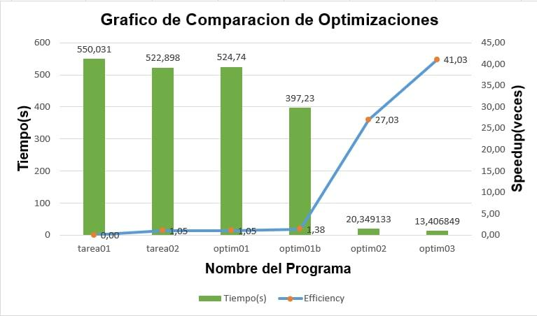

# *Reporte de la Tarea 03*
Para esta tarea era necesario hacer dos optimizaciones, la primera constaba del mapeo dinámico de los números y la segunda una optimización de propuesta libre, pero en este caso también se hizo una tercera optimización.

# Reporte de optimizaciones
## **Primera Optimizacion:**
* **Rendimiento del código después de la optimización**
-Primera corrida: 35.50 ms
-Segunda corrida: 35.11 ms
-Tercera corrida: 35.43 ms
* **Modificaciones necesarias para mejorar el rendimiento**
Se va a aplicar el diseño de mapeo dinámico para repartir los números con una cola (*thread save*). Se implementa un arreglo para los resultados y la posición de los resultados dentro del arreglo esta protegida por un mutex para llevar correctamente el conteo de la posición dentro de la estructura que almacena las sumas de cada numero.
* **Rendimiento del código después de la optimización**
-Primera corrida: 35.00 ms
-Segunda corrida: 35.06 ms
-Tercera corrida: 34.95 ms
* **Lecciones aprendidas**
En realidad con respecto a la implementación anterior, no se ve una diferencia real debido a que se había implementado el código con un mapeo dinámico por bloque de las sumas,lo que hacia que el código fuera *conditionally safe* y por lo tanto no tenia que agregar un mutex.
## **Optimización Opcional(1b):**
* **Rendimiento del código después de la optimización**
-Primera corrida: 35.00 ms
-Segunda corrida: 35.06 ms
-Tercera corrida: 34.95 ms
* **Análisis del código**

(En la imagen no se aprecia pero la agrego de igual manera)
El programa no reparte de manera equitativa el trabajo entre los hilos.

* **Modificaciones necesarias para mejorar el rendimiento**
Se va a realizar mas granular la unidad de descomposición, esto quiere decir que, cada hilo se va a repartir cierta cantidad de sumas para cada numero.
* **Rendimiento del código después de la optimización**
-Primera corrida: 19.14 ms
-Segunda corrida: 18.54 ms
-Tercera corrida: 19.20 ms

* **Lecciones aprendidas**

Speedup:
Para este caso es mas fácil trabajar con un array que contenga los números para evitar utilizar un mutex.
Esta optimización mejora mucho el rendimiento debido a que de esta manera los hilos se reparten equitativamente el trabajo. Cada hilo debe de tener su propia estructura donde guarde las sumas que iteró, para estos usé un vector de colas pero se podría usar un vector de vectores de enteros.

## **Segunda Optimización:**
* **Rendimiento del código después de la optimización**
-Primera corrida: 19.14 ms
-Segunda corrida: 18.54 ms
-Tercera corrida: 19.20 ms 

* **Análisis del código**

Luego del análisis del código opté por mejorara la eficiencia del método *is_prime*, ya que hace demasiadas iteraciones para algunos números.

* **Modificaciones necesarias para mejorar el rendimiento**
Para esta mejora se implementó un vector de primos booleano. Este vector es del tamaño del numero mas grandes de todos los ingresados. Como el calloc inicializa todas las posiciones en 0 entonces solo se tiene que poner en las posiciones que son números primos un 1, de esta manera podemos mapear todos los números primos necesarios para el programa y para verificar si un numero es primo o no, es tan sencillo como verificar esa posición(numero a probar) del vector, si tiene un 1 significa que es primo.
* **Rendimiento del código después de la optimización**
-Primera corrida: 22.18 ms
-Segunda corrida: 21.93 ms
-Tercera corrida: 21.59 ms

* **Lecciones aprendidas**

Para la búsqueda de los números primos no es necesarios recorrer los números pares, entonces, por cada iteración del for que llena el vector de primos, se podría aplicar la siguiente formula *(k*2+1)*, siendo esta la formula para averiguar los números impares que son los posibles primos y de esta manera ir iterando de uno en uno pero solo hasta la mitad excluida del número más grande ingresado, puesto que, la mitad son números pares que no es necesario revisarlos.
Además, no hubo un incremento de velocidad debido a que creando el vector de primos tarda su tiempo dependienta del número y en este caso el número más grande es mucho más grande(6 dígitos) que el resto de números(máximo de 4 dígitos) y esto causa que la creación de este vector más bien perjudique por que el resto de números no necesitan tantos números primos para calcular sus sumas.
## **Tercera Optimización:**
* **Rendimiento del código después de la optimización**
-Primera corrida: 22.18 ms
-Segunda corrida: 21.93 ms
-Tercera corrida: 21.59 ms

* **Análisis del código**

Luego de este análisis de código se puede observar que el método *weak_conjecture* hace demasiadas iteraciones y hay que reducir esa cantidad de iteraciones de alguna manera.
(Esta situación se puede ver marcada de rojo en la imagen)
* **Modificaciones necesarias para mejorar el rendimiento**
Se modifico el método *weakconjecture* ya que la cantidad de iteraciones que hace el segundo for se puede reducir a la mitad.

* **Rendimiento del código después de la optimización**
-Primera corrida: 21.35 ms
-Segunda corrida: 21.69 ms
-Tercera corrida: 21.15 ms

* **Lecciones aprendidas**

Podemos notar que para el caso *input008.txt* casi no hay diferencia debido a que es una caso de prueba muy pequeño, lo que causa, que la cantidad de iteraciones extra casi no se notan en este caso de prueba.
Esto reduce considerablemente la cantidad de iteraciones del método *weak_conjecture* ya que no era necesario tantas iteraciones, aunque, puede que haya algún cambio mas para que esto se reduzca aun mas.

# **Reporte de gráficos:**

## **Grafico de Optimizaciones:**

En esta caso podemos ver como hay una mejora significativa en el tiempo de ejecución del *input023* y por lo tanto un aumento significativo de la eficiencia por cada optimización.
Para empezar es evidente que el caso serial va a ser el que dure más, luego en el caso de *Opt.1* al programa se le pasan 8 hilos, esto acelera un poco el tiempo pero no mucho debido a que cada hilo esta haciendo solo un numero. De aquí en adelante se le pasan 8 hilos al programa; el caso de la *Opt.1b* cada hilo se reparte una cantidad de sumas, esto hace que el trabajo sea más equitativo y de esta manera los hilos se pueden ayudar a repartir la carga y durar menos.
Por último para la *Opt2* se cambió la manera en que se calculaban los números primos y se ve una mejora muy significativa en el tiempo, debido a que este cambio es mucho mas eficiente y luego en la *Opt.4* el cambio fue mas sutil, solo redujo la cantidad de iteraciones de un método a la mitad, esto en realidad sí se ve afectado en casos de prueba muy grandes, puesto que, para números muy grandes hacer solo la mitad de las iteraciones puede ser muy importante.
## **Grafico de Concurrencia:**

Podemos ver que el *Speedup* es muy parecido para todos lo casos, esto debido a que en realidad lo que tarda más ejecutándose del programa es la creación del vector de primos(este vector es creado solo por el hilo principal), por que, luego para obtener las sumas el tiempo es casi el mismo sin importar la cantidad de hilos ingresados. Esto pasa debido a que el numero más grande del *input023* es 10 000 000 y el programa tiene que hacer muchas iteraciones para crear el vector de primos, que es creado solo por el hilo principal. 
Por ultimo podemos observar que el que tiene mayor eficiencia es el caso con un solo hilo, esto pasa debido a que todos los tiempos de ejecución son muy parecidos y esto demuestra que en realidad, es más eficaz un solo hilo que hacer más hilos que significan un mayor gasto de recursos y tiempo en la creación estos hilos.